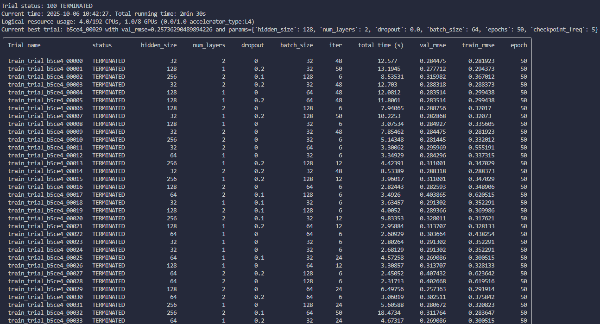
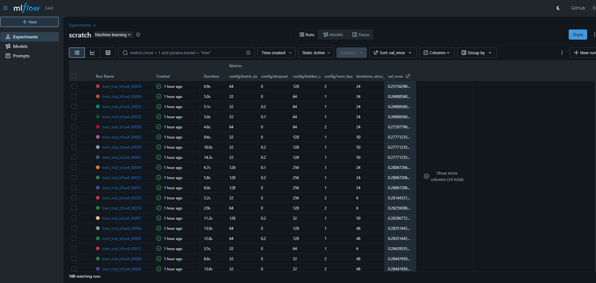
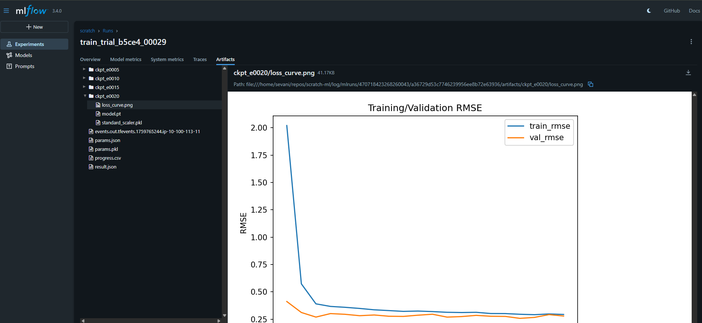

# scratch-ml
Sandbox environment to test Ray Train, Ray Tune, MLflow, and time series modeling together.

# Setup
This repo uses `uv` for handling virtual environments. If you don't have uv installed please see [uv docs](https://docs.astral.sh/uv/)

Once you have uv installed please run:
- `uv sync` (creates virtual env with all depdencies based on lock file)
- `source .venv/bin/activate`

# Data Creation
First we create some fake "sensor" time series data by pretending we are measuring three unique 1-5 V sensors. We produce this time series data with:
- A sine wave with added gaussian noise
- A square wave with added gaussian noise
- A triangle wave with added gassian noise

These three waves represent our "features". Now we want to produce our "target" waveform. The requirements for this "target" are:
-  It is a non-linear mix of the three "features"
- There is added guassian noise to mimic if this measurement was actually sampled from a real sensor
- The signal is time-shifted or has built in "lag" such that the target values depend not only on the current values of sine/square/triangle wave but also past values as well (forcing our ML model to have some sort of memory)
- The target is not stationary and shifted in some form so that the strength of the non-linear relationship changes throughout time so the signal approximation can't be learned easily

Finally to act like these signals came from 1-5 V sensors we wil rescale these measurements between 1-5.

All of this is implemented in `src/generate.py` which produces the data in `data/input/data_signals.csv`. We can look at the signals produced below:

# Model implementation and training
We implement a Long Short Term Memory (LSTM) model to capture the time dependent relationship between the feature signals and target signal. Ray Tune wraps our training loop and allows for hyperparameter optimization (HPO) which logs results to MLflow.

Training can be done by running `src/train.py` which will kick of a Ray Tune session. This session is configured to allocate 4vCPUs and 1 GPU per trial, running 100 total trials across the sample space of LSTM hyperparameters that include:
- hidden layers
- dropout effect
- dropout layers
- batch size for training

Ray will print status to the terminal with a concluding results table like the one shown below (the image below is clipped as not all 100 results can be shown on screen):

For more information on tuning with Ray
https://docs.ray.io/en/latest/tune/examples/tune-mlflow.html

Ray will log results to `log/ray_results/lstm_hpo` where the Ray UI can be used to view these logs. However, MLflow is also configured in the training loop with the Ray callback such that all information can be seen in MLflow itself. 

To launch MLflow UI users can run this in a seperate terminal (keep in mind you need to activate the same virtual environment)
`mlflow ui --backend-store-uri ./log/mlruns`

MLflow has been configured to log results to the experiment `scratch` where all of our 100 trials can be filtered, selected, or queried. MLflow offers a convienent summary table where we can easily see our best trial based on lowest validation RMSE and the associated hyperparameters if we select a few columns

In our training loop we have configured MLflow to checkpoint the model every 5 epochs trained, which will log both the scaler used, model, as well as a plot displaying training and validation loss across epochs. These artifacts can be accessed via MLflow after selecting a specfic trial as shown below:

